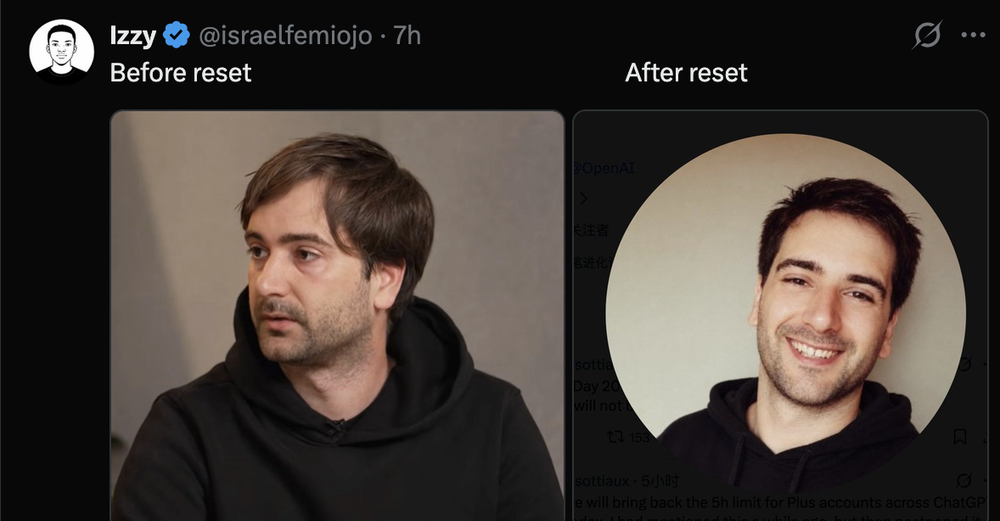

# Tibo — character bible

Recorded 2026-09-22. Read with [sources](../research/sources.md) and the [supplied X report](../research/tibo-x-report.md).

## Core identity

Real person: **Thibault “Tibo” Sottiaux**, public account **@thsottiaux**. The user's original spelling varied; use Thibault in factual prose and Tibo in the game.

Working game archetype: **aggressive quartermaster**. A friendly product/engineering operator who keeps the squad supplied, gives everyone another chance, and encourages them to spend the extra resources. The appearance meme adds an immediately readable transformation.

Working codenames discussed: The Reset Guy, Reset, Tokenburner, Quota Slayer. Tibo is the simplest display name. None is a finalized canon choice.

## Research and confidence

- OpenAI's May 2026 event page identifies him as the Codex lead and gives his earlier Google / DeepMind and academic background.
- A later official OpenAI page identifies him as Head of Core Products & Platform. Titles should be dated; the earlier Codex title and later broader role are not necessarily contradictory.
- Interview reporting describes usage resets as compensation for product issues, later also celebration / new-feature access; reporting says a physical button exists.
- The user's additional X research contributes product-shipping, community-support, capacity-planning, and dry-hype observations. Treat these as supplied persona research until original posts are checked.
- Do not infer health, actual aging, sleep deprivation, or employment effects from appearance. The “aging” is the community's joke and our fictional transformation device.

## Appearance references

The user identifies the left frame as Tibo in an interview and the right as his X avatar. The screenshot labels them “Before reset” and “After reset.”

Visible design anchors:

- Dark/black hoodie in both images.
- Brown hair, with longer side-swept hair in the interview frame and shorter/spikier styling in the avatar.
- Light stubble.
- Interview frame: neutral mid-speech expression; avatar: broad smile.

Use the reference for original pixel portraits and sprite silhouettes. Small sprites cannot carry subtle facial likeness by themselves. A large HUD portrait can show the meme clearly while hair shape and stance provide the in-world change. A resource pack and oversize button make the character readable even to someone unfamiliar with Tibo.

The supplied report says black crewneck/tee and suggests a headset or laptop rifle. Those are proposed cues; the attached photos show a hoodie, which is the preferred visual anchor.

## Reset / appearance meme

User account of the meme: people compared the profile image with his interview appearance and joked about what working at OpenAI does to someone. He joined in and handled the jokes well. User wants this woven into an ability.

Research found secondary reporting describing the comparison, avatar changes, haircut banter, and his participation. A mirrored August 27 post includes the exact short phrase **“Regaining my youth one button press at a time.”** Direct X access failed during our research; this quote was visible via mirrors. Do not imply the original post was independently retrieved.

The adaptation: RESET replenishes firepower **and** transforms him into his smiling profile-picture version. This is fictional exaggeration. The direction of the transformation matters: interview-inspired normal state → fresh avatar state on reset.

## Current prototype kit (iteration 021)

Primary fire spends a finite 1,000-token budget; scroll trades cost and recovery for power. No passive ammo regeneration or free fallback shot. F throws a physical RESET button that refills on impact and creates a local explosion; it no longer grants a power-up. The local usage readout stacks tokens burned during a firing run and visibly reloads after RESET. Hold Q for up to two seconds to absorb incoming shots into tokens. Each hit restores up to 24 tokens, capped at 1,000. The shield follows the mouse; releasing or timing out starts a two-second cooldown plus 0.025 seconds per token actually recovered. The recovered total and resulting cooldown are visible while holding. This replaces the earlier timed parry.

E is now **OTHER TIBO**, replacing the unrelated magnetic tether. The interview-inspired gunner summons his smiling profile-picture counterpart: a temporary unarmed brawler who leaps toward the cursor, grabs a robot, strips its armor, and throws it onward. He also body-blocks up to three hostile bullets and can be placed in empty space as temporary cover. Range 360px, lifetime 1.8s, cooldown 4.5s, no token cost. Touch the double after landing or a completed throw to catch him before expiry and immediately recharge E, with a spinning merge and “CAUGHT! · E READY” effect. Each successful throw sends six token sparks back to the player, crediting up to 60 tokens on arrival. No reward on a miss; no cooldown refund on expiry. Comic text: “YOU GET RESET!” The meme is fictional character staging, not a claim about his actual health or age.

## Original proposed kit (historical; superseded above)

### Token Hose — primary

A punchy automatic token weapon with rapid bright fragments and substantial environmental feedback. Holding fire spends a rechargeable **USAGE reserve** to maintain stronger output. Empty reserve falls back to a usable basic shot, so the player can continue fighting and moving. Basic shooting must always remain satisfying.

The game should encourage spending the reserve, then using RESET during pressure. No actual token billing or online account link is involved.

### Tibo Reset — special

Tibo slams an oversized physical button. A clear outward pulse:

1. Knocks nearby enemies away.
2. Refills his weapon resource.
3. Activates Profile-Picture Mode.
4. In future co-op, replenishes nearby teammates' weapon resources.

Reset uses a separate limited charge, with refills at checkpoints/rescues proposed for the first slice. **It must not refill its own charges or other characters' ultimate charges.** That avoids an infinite chain of specials.

### Profile-Picture Mode — reset payoff

For roughly four seconds (tunable): shorter/spikier hair, upright confident posture, huge grin, little sparkle, and maximum weapon output with no resource drain. On expiration, the normal hairstyle and expression return in one quick comic beat.

Movement speed remains predictable in both modes. Facial “wear” is a cosmetic expression of expenditure, not a reason to make the controls unpleasant.

### Visual loop

Fresh portrait → sustained barrage → increasingly frazzled portrait → RESET shockwave → immaculate grin → boosted token barrage.

Resource changes need a visible meter in addition to the portrait. Do not require reading facial expressions to understand ammunition.

## Design evolution worth retaining

1. Initial idea: token minigun with a heat meter; HARD RESET clears heat, repels enemies, and boosts fire for about three seconds.
2. Appearance reference: RESET also switches between the interview-inspired and avatar-inspired looks, with an approximately four-second empowered state.
3. Supplied X report: shifted from generic gunner toward generous squad quartermaster; preferred resource concept became USAGE reserve with a fallback shot.

Heat and USAGE are alternative representations of one combat resource, not a request to implement two simultaneous meters. The prototype should pick one. Latest preference: USAGE reserve.

## Ideas consolidated or deferred

- **Burn Those Tokens:** the overall combat rhythm, not another button or separate ultimate.
- **Start Your Engines:** fold the proposed speed/fire-rate excitement into RESET. Keep movement consistent initially.
- **Astra Cook / coding-agent drone:** defer. Autonomous helpers fit Peter's lobster-agent kit and would dilute Tibo's first prototype.
- **Physics Can't Be Cheated:** possible flavor text; the report's anti-exploit-mechanic suggestion is not a core feature.
- **Full team health/ammo/cooldown reset:** report proposal was too broad for the initial kit. Refill weapon resource; do not automatically restore health and all specials.
- **Backpack USAGE meter:** strong visual proposal, especially if it flashes to full alongside HUD refill.
- **Rate-limit UI confetti:** possible reset effect, kept brief enough not to obscure projectiles.

## Dialogue provenance

Short phrase independently found via mirrored public post: “Regaining my youth one button press at a time.”

Attributed phrases supplied by the user's report, not all independently verified as verbatim:

- “Ladies and gentlemen... start... your... ENGINES.”
- “Burn those tokens”
- “Reset all propagated. Sweet dreams.”
- “3am on a tuesday”
- “Sometimes physics can't be cheated”
- “See you soon.”
- “Always be shipping.”
- “Priority is existing users.”
- “There is never a boring day working in the open.”

Original fictional game line: **USAGE RESTORED. YOUTH RESTORED.** Do not attribute this to the real person.

Do not assume permission or a requirement for a voice impersonation. On-screen barks and original game audio are enough for the prototype.

## Proposed introduction

Tibo is behind a rate-limit barrier, calmly pressing a disconnected button. The player breaks him out. He reconnects the cable, presses RESET, and the squad's weapon meters fill. This is a future roster/rescue introduction; a Tibo-only prototype can begin with him already playable.

## Play-test questions

- Does firing feel good at both full and empty USAGE?
- Is RESET a legible, immediate payoff?
- Can a new player understand why it is useful without knowing the meme?
- Does the portrait transformation register during actual combat?
- Are there meaningful reasons to save the charge or spend it now?
- Is he an aggressive operator who supplies the team, rather than a passive healer?
